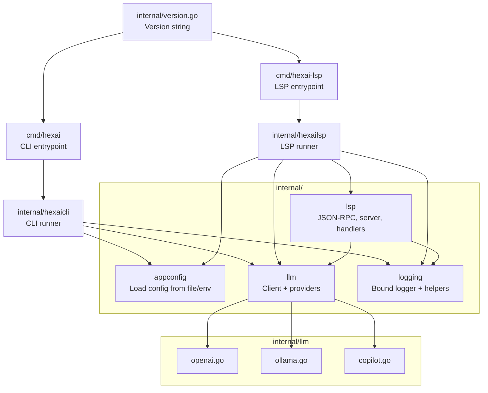

# Source code structure

This document provides a high‑level map of the Hexai source layout and how the
main packages relate to each other.

## Diagram



## ASCII diagram

```
                          +----------------------+
                          | internal/version.go  |
                          +----------------------+
                               |  provides Version
                 +-------------+-------------+
                 |                           |
          +--------------+            +----------------+
          | cmd/hexai    |            | cmd/hexai-lsp  |
          | (CLI)        |            | (LSP server)   |
          +--------------+            +----------------+
                 |                           |
                 v                           v
        +------------------+          +------------------+
        | internal/hexaicli|          | internal/hexailsp|
        | (CLI runner)     |          | (LSP runner)     |
        +------------------+          +------------------+
            |    |    |                     |   |   |
            |    |    |                     |   |   +----> logging
            |    |    +----> logging        |   +--------> llm (client)
            |    +--------> llm (client)    +-------------> appconfig
            +-------------> appconfig                    |
                                                       builds options
                                                           v
                                                    +------------------+
                                                    | internal/lsp     |
                                                    | (server, JSON-RPC|
                                                    |  handlers, docs) |
                                                    +------------------+
                                                         |        |
                                                         |        +----> logging
                                                         +-------------> llm (client)

  llm providers:
    +-----------------------------+
    | internal/llm/providers      |
    |  - openai.go                |
    |  - ollama.go                |
    |  - copilot.go               |
    +-----------------------------+

  shared libs:
    - internal/appconfig: config from file/env
    - internal/logging: logger binding + helpers
```

## Module overview

- cmd/hexai: CLI binary that parses flags, prints version via `internal.Version`,
  and delegates to `internal/hexaicli.Run`.
- cmd/hexai-lsp: LSP server binary that parses flags, prints version, and calls
  `internal/hexailsp.Run` (stdio JSON‑RPC server).
- internal/hexaicli: CLI flow — reads stdin/args, loads config, builds an LLM
  client, constructs messages, and runs a single chat request (streaming when
  supported).
- internal/hexailsp: LSP orchestration — binds logging, loads config, builds the
  LLM client, constructs `internal/lsp.ServerOptions`, and runs the server.
- internal/lsp: Minimal LSP over stdio — document store, JSON‑RPC handlers
  (initialize, completion, code action, etc.), context building, and a small
  completion cache.
- internal/llm: Provider‑agnostic client interface plus concrete providers for
  OpenAI, GitHub Copilot, and Ollama, including streaming support where
  available.
- internal/appconfig: Loads user configuration from file and environment, shared
  by both CLI and LSP paths.
- internal/logging: Central logger binding and small helpers for consistent,
  readable logs and chat summaries.
- internal/version.go: Single place for the version string used by both
  binaries.

## Typical flows

- CLI: `cmd/hexai` → `internal/hexaicli` → `internal/appconfig` → `internal/llm`
  (providers) → print output and a short summary line.
- LSP: `cmd/hexai-lsp` → `internal/hexailsp` → `internal/lsp.Server` →
  request handlers → `internal/llm` for completions/actions.
