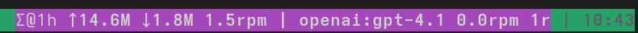

# Helix + tmux Quickstart

This guide gets you from zero to editing with Hexai in Helix, with tmux showing live LLM status.



Hexai can surface live progress in tmux's status line via a user option. Add this to your `~/.tmux.conf`:

## Configure it

```
set -g status-right '#{@hexai_status} #[fg=colour8]| %H:%M'
```

- Note: `colour8` is typically “bright black” (a dim grey) in many themes.
  If it’s low-contrast on your background, change it (e.g., `colour7` or `white`).

- CLI updates `@hexai_status` at start (⏳ provider:model) and on completion with compact stats (↑sent, ↓recv, rpm, reqs).
- LSP emits an initial heartbeat on client initialize and periodic compact stats (provider, model, rpm, reqs, bytes).
- The TUI action runner sets a ready heartbeat and a completion heartbeat with stats.
- Toggle with `HEXAI_TMUX_STATUS=0` to disable (enabled by default).

The status segment supports simple theming:

- Preset themes:
  - `HEXAI_TMUX_STATUS_THEME=white-on-purple` (white fg on purple/magenta bg)
  - `HEXAI_TMUX_STATUS_THEME=black-on-yellow` (black fg on yellow bg)
- Explicit colors: set any tmux color names or 256-color codes
  - `HEXAI_TMUX_STATUS_FG=white`
  - `HEXAI_TMUX_STATUS_BG=magenta` (or `colour5`, etc.)
- If the segment is truncated, widen it: `set -g status-right-length 120`

Add this to `~/config/tmux/tmux.conf` and restart tmux.

```
set -g status-right '#{@hexai_status} #[fg=colour8]| %H:%M'
set -g status-right-length 120

# Optional: theme the Hexai status segment
set-environment -g HEXAI_TMUX_STATUS_THEME white-on-purple   # or black-on-yellow, white-on-blue
# Or explicit colors
# set-environment -g HEXAI_TMUX_STATUS_FG white
# set-environment -g HEXAI_TMUX_STATUS_BG magenta

# Optional: narrow / width-limited mode
# Only show Σ (global) when narrow; or cap total width when long
# set-environment -g HEXAI_TMUX_STATUS_NARROW 1
# set-environment -g HEXAI_TMUX_STATUS_MAXLEN 40
```

## Use it

- Start tmux, open Helix on a Go file.
- Try completions or inline prompts; or select code and press Alt-a for the action menu.
- Watch the right side of your tmux status for live LLM stats:
  - Start heartbeat: provider:model ⏳
  - Global stats (Σ@window): ↑sent ↓recv rpm reqs
  - Per-model tail is elided in narrow mode or when exceeding `HEXAI_TMUX_STATUS_MAXLEN`.

## Global stats window

- Hexai aggregates stats across all binaries and shows a global Σ view over a sliding window.
- Configure the window in `~/.config/hexai/config.toml`:

```
[stats]
window_minutes = 60  # default 60; min 1, max 1440
```

- The tmux status shows the window as `Σ@1h` or `Σ@45m`.
